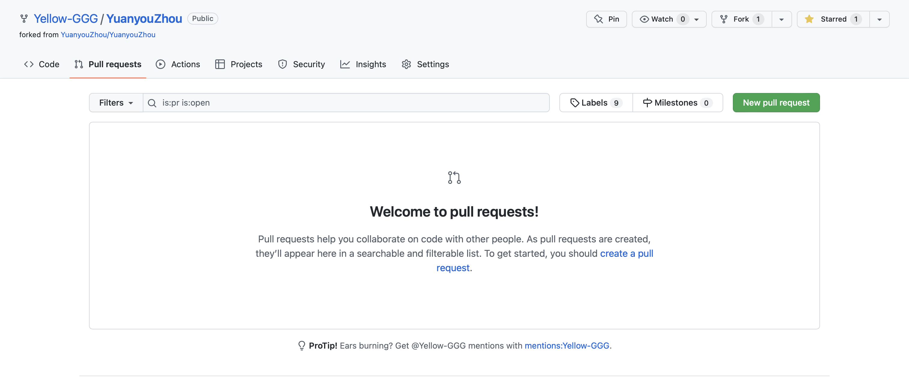
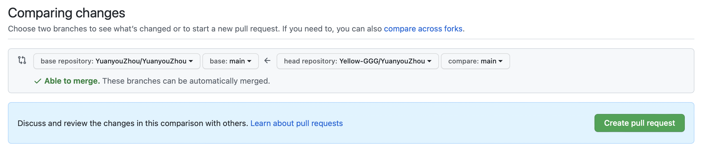

# 贡献指导

我们的工作成果离不开社区成员们的无私奉献，我们也非常诚挚地欢迎你的加入，我们可以一同努力，帮助我们的网页做得更好。不过在此之前，我们还需要进行一些规范以及约定，以便我们的工作顺利进行，于是我们会需要这一篇贡献指导。如果你有意愿加入到文档的编撰工作中来，还希望您首先仔细阅读本文中所述内容，并依照规范进行操作。也欢迎随时在Discord群聊中与我们取得联络！

## 当前工作情况

当前我们正处在项目的起始阶段，在内容上还相当贫乏。不过不必着急，主页中文档的建设工作并非我们当前的工作重点，而仅仅作为我们游戏项目开发之余顺水推舟，可以在有想法时随时向其中补充内容。在文档建设方面我们暂时并没有详细的计划与要求，其中工作仅由社区成员自发完成。

尽管如此，我们仍然十分推荐成员们将开发工作所需的技术指导类文档放在我们的主页之下，同时也欢迎参与文中内容的充实、修缮工作。一方面我们的主页可以为项目文档提供一个统一的存放与展示空间，方便项目成员随时查看与跟进。再者，作为一个开放、共享的社区，我们也希望各位能够将资源、技术等分享给其他成员，惠及更多人。而我们官网中的文档集就为我们提供了这样一个分享的渠道，帮助我们互相学习与进步。

我们对于这些文档未来的建设与发展方向也做了一定的规划。本网页中的所有内容都在信息公开许可证CC-BY-SA-4.0下开源，贡献者们的著作权都可以得到一定程度的保障。我们希望在未来将这里建设成为一个游戏开发的全栈知识库，兼具内容的丰富性与系统性。而开放源码、共同创作的方式可以让其中内容的时效性得到有效保障，并且可以在不断地整理与修缮中不断提高内容的质量。我们甚至有可能像[《动手学深度学习》](https://github.com/d2l-ai/d2l-zh)这本开源著作一样整理出版，不过这都是后话了。

目前而言，如前所述，我们也并不强求文档建设取得怎样的成果，仅凭自身意愿随意写作即可。对于文中所写内容，我们也没有任何限制。等待内容积累达到一定数量之后，我们会对已有内容进行整理、修订等，并将其中质量较高的文本放入主页侧边栏的细分项目当中。在此之前，我们会要求新创作的文本统一放置到「新文」文件夹下。

我们也非常欢迎成员们帮助补充完善「开发工具索引」和「素材资源索引」两个文档中的内容！

## 文档结构

本项目（[远游舟空间](https://github.com/YuanyouZhou/YuanyouZhou)）文档采用开源软件[Docsify](https://docsify.js.org/#/)动态生成，并应用[Docsify-Themable](https://jhildenbiddle.github.io/docsify-themeable/#/)进行主题装饰。在项目文档工作中我们也采用了其他Docsify插件进行优化。如果您比较熟悉Docsify的使用方式，我们非常欢迎您参与到文档的整理以及网页的优化建设当中。当然如果您对此不甚了解，其实也并无大碍。我们可以在直接参考已有的文档内容，新建并使用Markdown格式进行写作，调试完毕并通过审核后即可将自己的工作成果合并进入项目主仓库当中。也可以随时联络我们以取得帮助。

我们现在开始对项目中的各个文件/文件夹的作用进行一些简单的解释。

* \_media（媒体）

这个文件夹用于存储文档中所需要使用到的各类媒体资源。其中包括有项目图标以及文档中文章所需要使用的图片等媒体素材。需要注意的是这里仅用作需要长期存储的资源的存储，换言之，\_media仅供经过整理选入知识库内的文章的媒体资源的存储。对于「新文」文件夹下新近创作的技术文章，我们推荐使用[Picgo](https://molunerfinn.com/PicGo/)等图床工具上传图片并通过外部链接进行预览。

* 新文

这个文件夹用于存放本项目中最新编写的技术文章，即「新文」。我们推荐最新写作的文章首先放入这一文件夹下，此后我们会定期进行整理并将结果放入各模块的主目录下。当前这里也是我们的主要工作目录。

* 最新消息

这个文件夹用于保存记录项目周边的新闻以及一些最新的进展，我们所有的通知都会在这里留有备份以供随时查看。我们也可以在此查看项目最近的工作进展情况。

* 关于

这个文件夹中包括「远游舟」项目的相关介绍、本文档的贡献指导以及友情链接等。

* \_sidebar.md

这个文件是Docsify边栏的源代码。在文档更新完毕后记得在此处新建链接以便访问。Docsify首先会读取当前目录下的边栏源码，如果没有则将会回滚到上级目录。

* 开发工具索引/素材资源索引

这两个文档用于粗略地存放各类资源链接，分别对应游戏的开发工具以及音画素材等等内容。它们能够大体上为我们的工作提供指导，至少可以为我们解决需求指明一个大致的方向而不至于迷失。我们也非常欢迎同志们积极补充两文档中的内容。

## 贡献方式

在了解项目中文档的基本结构之后，我们就可以在此基础上开始撰写文稿并尝试为文档做出贡献了！不过在此之前，我们还需要确定项目的协作方案。这其实并不复杂，与许多开源项目类似，我们的源代码都在GitHub仓库中公开，而它也是我们主要的协作平台。请不要感到惊慌，对于团队协作而言，这些都是相当基础的操作。对于GitHub的协作方式，可以参考其它文本中更加详尽的介绍。

在开始编撰工作之前，我们首先需要在GitHub当中找到[项目仓库](https://github.com/YuanyouZhou/YuanyouZhou)并进行Fork：


这将会在你的名下创建一个本仓库的副本。此后可以将该副本下载到本地，这会是你之后的工作区。你可以在本地自由地编写项目内容，并通过Docsify进行本地预览，观察修改效果。这首先要求我们在本地安装好`Node.js`以及`npm`环境。我们建议通过npm实现全局安装命令行工具docsify-cli，指令如下：

```shell
npm i docsify-cli -g
```

此后当你需要预览编辑结果时，可以在项目根目录中打开终端，并输入以下指令：

```shell
docsify serve docs
```

或者在docs目录下输入指令：

```shell
docsify serve
```

此后在浏览器中输入链接`https://localhost:3000`即可实时预览编写结果。（docsify默认使用3000端口）

待调整至效果满意之后，我们就可以通过Git将修改结果上传至云端仓库，并在准备妥当后向主仓库发起Pull Request，申请合并进入主仓库当中。





待团队中的核心成员审核通过后，你的贡献就可以通过PR并成为项目的一部分了！当然，如果你有意愿成为项目的核心成员，可以尝试与我们当前活跃的核心成员取得联系。我们也期待着与你展开更进一步的合作！

## 注意事项

稍等！在开始为本项目做出贡献之前，还有许多细节需要额外注意……

（嗯，这部分想到哪写到哪吧）

* 尽量使用中文进行写作。

当前本项目规模仍十分有限，当前我们仅面向中国地区读者，暂时也并没有应用其他语言的计划。

* 中文排版中推荐使用直角引号「」和『』。

* 为保证视觉效果的统一，请尽量使用三个主题色或者相近的色彩装饰页面。

本项目在立项之初选定了三个主题色，可以在`YuanyouZhou.css`文件开头找到。它们分别是theme-color-sky(#bdd0f1), theme-color-sea(#3b60a0)以及theme-color-paper(#f5f6f8)。

* 在Markdown中引用_media文件夹中图片时，注意应使用当前文件位置的相对路径。

这一项的具体写法可以参考这篇「贡献指导」中的操作。

* 我们通过插件[docsify-tabs](https://jhildenbiddle.github.io/docsify-tabs/#/)实现了一些扩展的Markdown语法，如有需要可以查看使用。

---

最后，感谢你能够完整地阅读完这篇「贡献指导」，我们也期待着与你的进一步合作！
